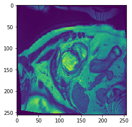
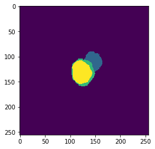
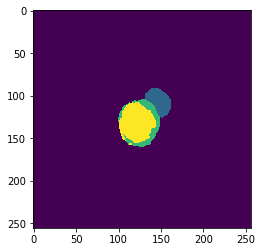
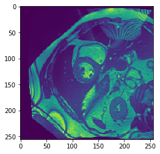
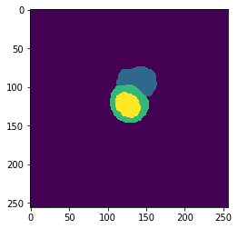

# Automated Cardiac Diagnosis Challenge

CT Slice             |  Label                    | Prediction
:-------------------------:|:-------------------------:|:-------------------------:
  |   |  
  |   |  

[Competition Link](https://www.creatis.insa-lyon.fr/Challenge/acdc/evaluationSegmentation.html)

## Overview

### Outline

The goal of this challenge is to segment three areas of the heart. The **left ventricle** *(yellow)*, **myocardium** *(green)* and **right ventricle** *(blue)* for the both end diastolic (ED) and end systolic phase (ES). The reason this is import is it allows the calculation of myocardial mass, myocardial thickness, volumes of the left and right ventricles  and stroke volume at different phases. All this information is helpful in understanding the health of the heart and in diagnosing cardiomyopathy.

### Metrics

A full list of the metrics used can be found [here](https://www.creatis.insa-lyon.fr/Challenge/acdc/evaluationSegmentation.html). In brief they involve DICE, end diastolic and end systolic volumes for the left and right ventricles, As well as measurements involving volume and mass of the myocardium at both end diastolic and end systolic phases.

### Data

The data set includes 100 patients in the training, set which labels were provided for and 50 in the hold out test set with no labels, that needed to be submitted online to get results.
The training and test consisted of 5 categories with each category making up 20% of each set.

- healthy patients
- patients with previous myocardial infarction
- patients with dilated cardiomyopathy
- patients with an hypertrophic cardiomyopathy
- patients with abnormal right ventricle

The data format was NIfITI format which is a format developed by Neuroimaging Informatics Technology Initiative and used for medical imaging. Each file contains image data, a series of slices of the MRI (the images at the top of the page are two of these slices from different NIfITI files), some associated metadata and a reference space.

## Approach

Selected model 2d unet Although the 3d 2d unet ensemble showed the best results it would be computinally heavy o that why the 2d unet was decided on.

Experiment with different loss functions
cross entropy, DICE

## Results

### Training

### Competition Results

## Future Improvements Experiments